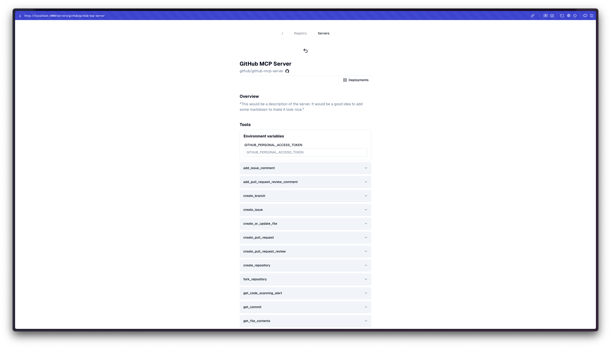
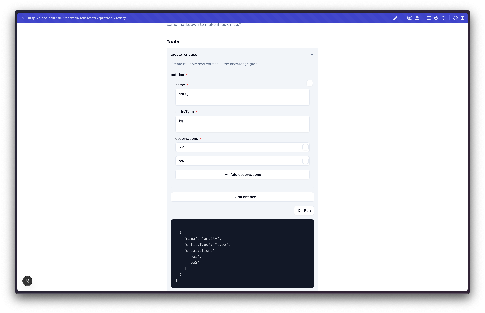

# mcp-registry

A Registry for mcp servers.

<details>
<summary>screenshot</summary>








</details>

## 서버 요구 사항

- docker
- node

## Docs

- [component diagram](./docs/component-diagram.md)
- [db relations](./docs/db-relations.md)
- [process diagram](./docs/process-diagram.md)
- [process flow](./docs/process-flow.md)

## Get started

> Local setup

### Prerequisites

- [node](https://nodejs.org/ko/download)
- [bun](https://bun.sh/)
- setup harbor(private docker registry): https://github.com/JHSeo-git/harbor-helm-starter
- docker + docker compose:  
  personal: [orbstack](https://orbstack.dev/)  
  company: [rancher desktop](https://rancherdesktop.io/)

### .env

```bash
cp .env.example .env
```

```
POSTGRES_DB="your database name"
POSTGRES_USER="your database username"
POSTGRES_PASSWORD="your database password"
POSTGRES_URL="your database url"

# for docker build, run, push, pull
DOCKER_DOMAIN="your docker domain"
DOCKER_USER="your docker username"
DOCKER_PASSWORD="your docker password"

# for git clone
GITHUB_TOKEN="your github token"
```

### Installation

- bun: https://bun.sh/docs/installation

```bash
bun i
```

### Docker compose up

```bash
docker compose up -d
```

### DB Migration

```bash
bun db:m
```

### Development run

```bash
bun dev
```

### Build

```bash
bun run build
```

### tool

```bash
bun lint:fix
bun format:write
```

## TODO

- [ ] github token 용 프로젝트 계정 생성 필요
