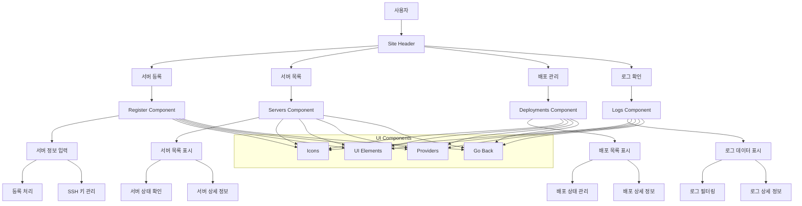

## 컴포넌트 흐름 설명

1. **사용자 인터페이스 흐름**

   - 사용자는 Site Header를 통해 주요 기능에 접근
   - 네비게이션 메뉴를 통해 각 컴포넌트로 이동

2. **서버 등록 흐름**

   - Register 컴포넌트에서 서버 정보 입력
   - SSH 키 관리 기능 포함
   - 입력된 정보를 기반으로 서버 등록 처리

3. **서버 관리 흐름**

   - Servers 컴포넌트에서 등록된 서버 목록 표시
   - 각 서버의 상태 모니터링
   - 서버 상세 정보 확인 기능

4. **배포 관리 흐름**

   - Deployments 컴포넌트에서 배포 목록 관리
   - 배포 상태 및 진행 상황 확인
   - 배포 상세 정보 확인 기능

5. **로그 관리 흐름**

   - Logs 컴포넌트에서 시스템 로그 확인
   - 로그 필터링 및 검색 기능 제공
   - 로그 상세 정보 확인 기능

6. **공통 UI 요소**
   - Icons 컴포넌트: 전체 시스템에서 사용되는 아이콘
   - UI Elements: 재사용 가능한 UI 컴포넌트들
   - Providers: 전역 상태 관리 및 컨텍스트 제공
   - Go Back: 뒤로가기 네비게이션 컴포넌트
