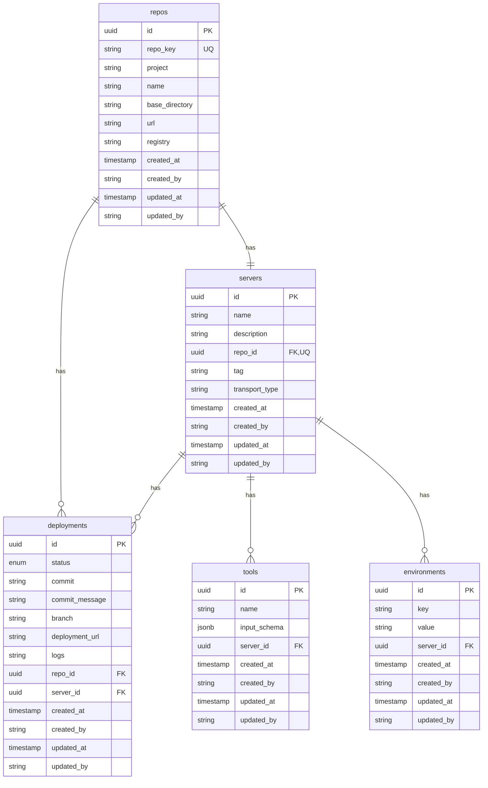

# MCP Registry 데이터베이스 관계도

## 테이블 관계

## 관계 설명

1. **Repos - Deployments (1:N)**

   - 하나의 레포지토리는 여러 개의 배포를 가질 수 있습니다.
   - `deployments.repo_id`가 `repos.id`를 참조합니다.

2. **Repos - Servers (1:1)**

   - 하나의 레포지토리는 하나의 서버를 가질 수 있습니다.
   - `servers.repo_id`가 `repos.id`를 참조하며, 유니크 제약조건이 있습니다.

3. **Servers - Deployments (1:N)**

   - 하나의 서버는 여러 개의 배포를 가질 수 있습니다.
   - `deployments.server_id`가 `servers.id`를 참조합니다.

4. **Servers - Tools (1:N)**

   - 하나의 서버는 여러 개의 도구를 가질 수 있습니다.
   - `tools.server_id`가 `servers.id`를 참조합니다.
   - `server_id`와 `name`의 조합은 유니크해야 합니다.

5. **Servers - Environments (1:N)**
   - 하나의 서버는 여러 개의 환경 변수를 가질 수 있습니다.
   - `environments.server_id`가 `servers.id`를 참조합니다.
   - `server_id`와 `key`의 조합은 유니크해야 합니다.

## 주요 인덱스

- `uq_repos_repo_key`: `repos.repo_key`에 대한 유니크 인덱스
- `uq_servers_repo_id`: `servers.repo_id`에 대한 유니크 인덱스
- `idx_tools_server_id`: `tools.server_id`에 대한 인덱스
- `idx_environments_server_id`: `environments.server_id`에 대한 인덱스
- `idx_deployments_repo_id_server_id`: `deployments.repo_id`와 `server_id`의 복합 인덱스

## 유니크 제약조건

- `uq_repos_repo_key`: `repos` 테이블의 `repo_key`
- `uq_servers_repo_id`: `servers` 테이블의 `repo_id`
- `uq_tools_server_id_name`: `tools` 테이블의 `server_id`와 `name` 조합
- `uq_environments_server_id_key`: `environments` 테이블의 `server_id`와 `key` 조합
