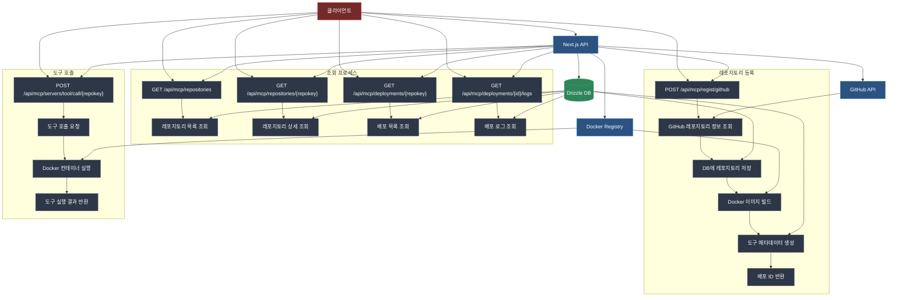

## 다이어그램 설명

### 주요 컴포넌트

1. **클라이언트**

   - 웹 인터페이스를 통해 시스템과 상호작용
   - API 요청을 통해 다양한 기능 수행

2. **Next.js API**

   - 모든 API 요청의 진입점
   - 비즈니스 로직 처리
   - 외부 서비스와의 통합 관리

3. **Drizzle DB**

   - 레포지토리 정보 저장
   - 배포 상태 및 로그 관리
   - 도구 메타데이터 관리
   - 데이터 영속성 보장

4. **GitHub API**

   - 레포지토리 정보 조회
   - 소스 코드 클론
   - 커밋 정보 관리

5. **Docker Registry**
   - Docker 이미지 빌드
   - 이미지 저장 및 관리
   - 도구 실행을 위한 컨테이너 제공

### 프로세스 흐름

1. **레포지토리 등록**

   - GitHub 레포지토리 정보 조회
   - DB에 레포지토리 정보 저장
   - Docker 이미지 빌드
   - 도구 메타데이터 생성
   - 배포 ID 반환

2. **조회 프로세스**

   - 레포지토리 목록 조회
   - 레포지토리 상세 조회
   - 배포 목록 조회
   - 배포 로그 조회

3. **도구 호출 프로세스**
   - 도구 호출 요청
   - Docker 컨테이너 실행
   - 도구 실행 결과 반환

### 데이터 흐름

- 실선 화살표: 주요 데이터 흐름
- 서브그래프: 관련 프로세스 그룹화

### 주요 API 엔드포인트

1. **레포지토리 관리**

   - `POST /api/mcp/regist/github`: GitHub 레포지토리 등록
   - `GET /api/mcp/repositories`: 레포지토리 목록 조회
   - `GET /api/mcp/repositories/{repokey}`: 레포지토리 상세 조회

2. **배포 관리**

   - `GET /api/mcp/deployments/{repokey}`: 배포 목록 조회
   - `GET /api/mcp/deployments/{id}/logs`: 배포 로그 조회

3. **도구 호출**
   - `POST /api/mcp/servers/tool/call/{repokey}`: 도구 호출 및 실행

```

```
