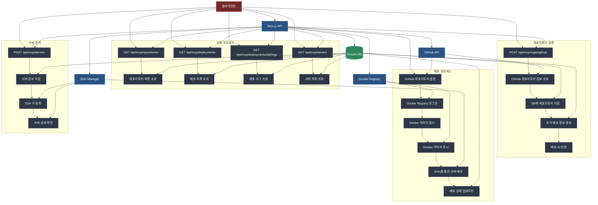

## 다이어그램 설명

### 주요 컴포넌트

1. **클라이언트**

   - 웹 인터페이스를 통해 시스템과 상호작용
   - API 요청을 통해 다양한 기능 수행

2. **Next.js API**

   - 모든 API 요청의 진입점
   - 비즈니스 로직 처리
   - 외부 서비스와의 통합 관리

3. **Drizzle DB**

   - 레포지토리 정보 저장
   - 배포 상태 및 로그 관리
   - 서버 정보 관리
   - 데이터 영속성 보장

4. **GitHub API**

   - 레포지토리 정보 조회
   - 소스 코드 클론
   - 커밋 정보 관리

5. **Docker Registry**

   - Docker 이미지 빌드
   - 이미지 저장 및 관리
   - 배포 이미지 제공

6. **SSH Manager**
   - 서버 SSH 키 관리
   - 원격 서버 배포
   - 서버 상태 모니터링

### 프로세스 흐름

1. **레포지토리 등록**

   - GitHub 레포지토리 정보 조회
   - DB에 레포지토리 정보 저장
   - 초기 배포 정보 생성

2. **배포 프로세스**

   - 소스 코드 클론
   - Docker 이미지 빌드 및 푸시
   - SSH를 통한 서버 배포
   - 배포 상태 실시간 업데이트

3. **조회 프로세스**

   - 레포지토리 목록 조회
   - 배포 목록 조회
   - 배포 로그 조회
   - 서버 목록 조회

4. **서버 관리 프로세스**
   - 서버 정보 등록
   - SSH 키 관리
   - 서버 상태 모니터링

### 데이터 흐름

- 실선 화살표: 주요 데이터 흐름
- 점선 화살표: 보조 데이터 흐름
- 서브그래프: 관련 프로세스 그룹화
