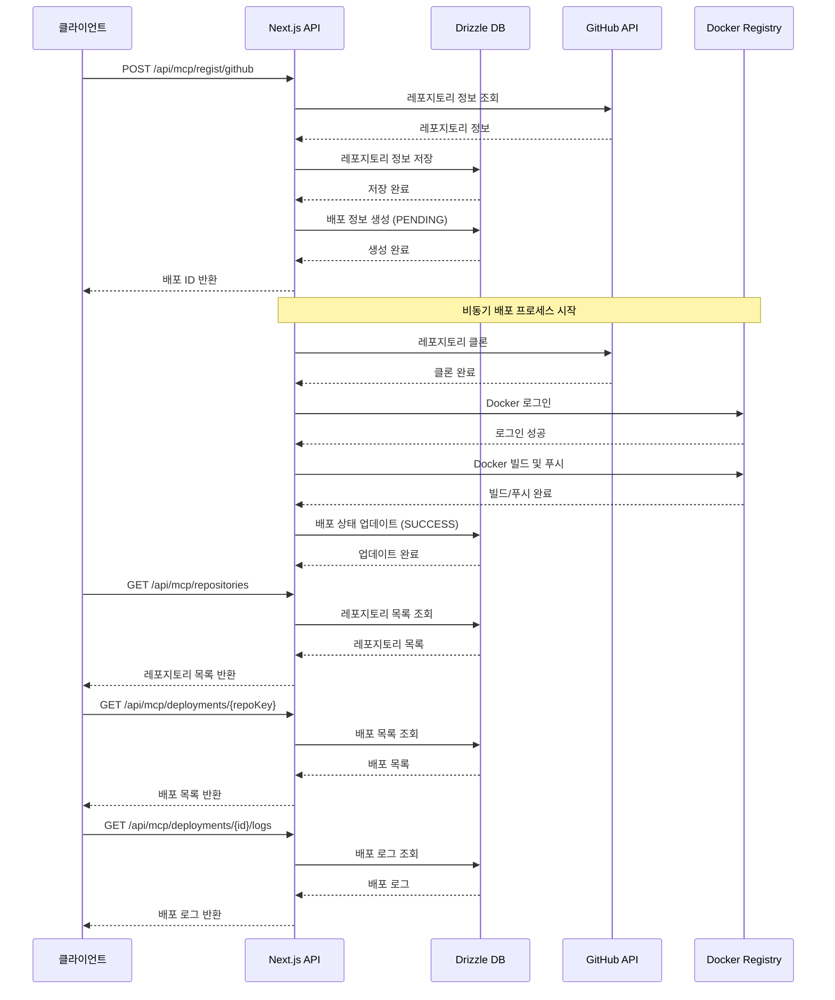

## 프로세스 흐름 설명

1. **레포지토리 등록 프로세스**

   - 클라이언트가 GitHub 레포지토리 등록 요청
   - GitHub API를 통해 레포지토리 정보 조회
   - Drizzle DB에 레포지토리 정보 저장
   - 초기 배포 정보 생성 (PENDING 상태)
   - 배포 ID 반환

2. **배포 프로세스 (비동기)**

   - GitHub에서 레포지토리 클론
   - Docker Registry 로그인
   - Docker 이미지 빌드 및 푸시
   - 배포 상태 실시간 업데이트
   - 최종 상태 업데이트 (SUCCESS/FAILED)

3. **레포지토리 목록 조회**

   - 등록된 모든 레포지토리 목록 조회
   - Drizzle DB에서 데이터 조회
   - 클라이언트에 목록 반환

4. **배포 목록 조회**

   - 특정 레포지토리의 배포 목록 조회
   - repo-key를 기준으로 필터링
   - Drizzle DB에서 데이터 조회
   - 클라이언트에 목록 반환

5. **배포 로그 조회**
   - 특정 배포의 상세 로그 조회
   - 배포 ID를 기준으로 조회
   - Drizzle DB에서 로그 데이터 조회
   - 클라이언트에 로그 반환

## 기술 스택

- Next.js API Routes
- Drizzle ORM
- GitHub API
- Docker Registry
- PostgreSQL (Drizzle DB)
